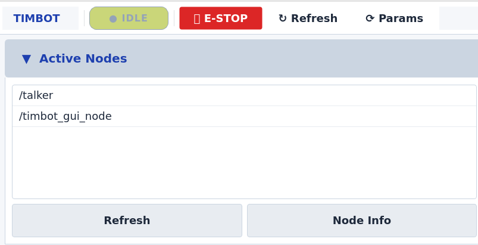
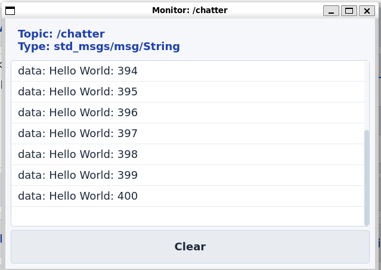
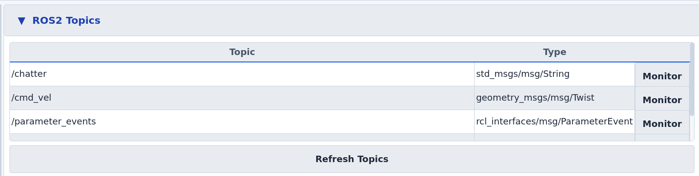
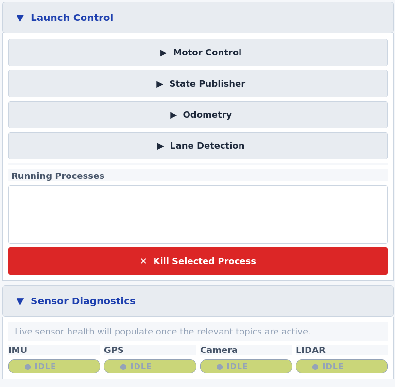
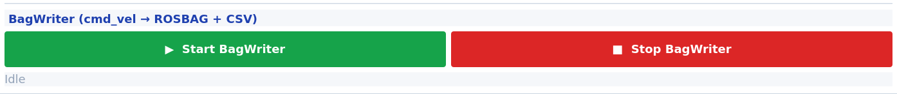
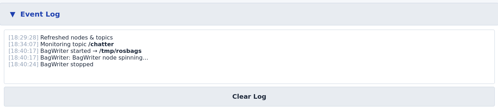

# Timbot GUI - Node Management and Topic Monitoring

A comprehensive PyQt5-based GUI application for managing and monitoring ROS2 nodes and topics in the Timbot rover.

## Features

### 1. **Nodes Tab**
- **View Active Nodes**: Display all currently running ROS2 nodes
- **Auto-Refresh**: Nodes list updates automatically every 5 seconds
- **Node Info**: Click "Get Node Info" to view detailed information about any node (subscriptions, publications, services)
- **Manual Refresh**: Manually refresh the node list on demand

<p align="center">
   
</p>

### 2. **Topics Tab**
- **View All Topics**: Display all active ROS2 topics with their message types
- **Real-time Monitoring**: Click "Monitor" on any topic to view live messages
- **Message Display**: Messages are displayed in a separate window

<p align="center">
   
</p>
- **History**: Last 100 messages are kept for reference
- **Clear History**: Clear the message display window at any time

<p align="center">
   
</p>

### 3. **Launch Control Tab**
- **One-Click Launch**: Quick buttons to launch common rover subsystems:
  - Motor Control
  - Odometry
  - Lane Detection
- **Launch Mode Selector**: Choose `Simulation` or `Competition` before starting a subsystem
- **Process Management**: View all currently launched processes with their PIDs
- **Kill Processes**: Terminate any launched process with a single click

<p align="center">
   
</p>

### 4. **BagWriter**
- **cmd_vel-focused logging**: Records `/cmd_vel` to a rosbag and writes a `cmd_vel.csv` snapshot (throttled to 1 Hz)
- **Native rosbag2_py**: Uses the Python writer directly instead of the `ros2 bag` CLI, preferring MCAP when available and otherwise falling back to the installed default storage backend
- **Custom Output Directory**: Specify where to save rosbag files

<p align="center">
   
</p>

### 5. **Event Log**
- **Timestamped activity feed**: Captures GUI actions like refreshes, launches, and recordings
- **Quick auditing**: Helps confirm what started or stopped without checking the terminal
- **Clearable**: One-click clear for fresh troubleshooting sessions

<p align="center">
   
</p>

## Installation

### Prerequisites
```bash
# Install PyQt5
pip3 install PyQt5>=5.15.0

# Or via apt (Ubuntu/Debian)
sudo apt-get install python3-pyqt5
```

### Build the Package

Make sure to be in the timbot directory

```bash
cd ~/timbot
colcon build --packages-select timbot_gui
source install/setup.bash
```

## Usage

### Start the GUI
```bash
ros2 run timbot_gui timbot_gui
```

The application will open with a tabbed interface showing:
1. Active ROS2 nodes
2. Available topics with monitoring capabilities
3. Launch control for common subsystems

BagWriter can be started from the BagWriter panel. It records `/cmd_vel`
to a rosbag and writes a `cmd_vel.csv` snapshot in the selected output directory.
Use the Launch Control mode selector to choose whether subsystem buttons start
simulation nodes or the real rover competition stack.

# Testing
1) Launch the GUI
```bash
cd ~/timbot
source install/setup.bash
ros2 run timbot_gui timbot_gui
```

2) Nodes Tab
```bash
ros2 run demo_nodes_cpp talker
```

3) BagWriter
Start BagWriter from the BagWriter panel, then publish a single velocity command:
```bash
ros2 topic pub /cmd_vel geometry_msgs/msg/Twist \
  '{linear: {x: 0.5, y: 0.0, z: 0.0}, angular: {x: 0.0, y: 0.0, z: 0.1}}'
```
Stop BagWriter and confirm the output directory contains a `bag_YYYYMMDD_HHMMSS` folder
and a `cmd_vel.csv` file.

### Workflow Example

1. **Monitor System Status**
   - Open the GUI
   - Check the "Nodes" tab to see all running nodes
   - Use the "Topics" tab to monitor key sensor data in real-time

2. **Launch Subsystems**
   - Choose `Simulation` or `Competition` in the Launch Control panel
   - Click the appropriate button in the "Launch Control" tab
   - Monitor the process in the "Launched Processes" section
   - Terminate processes as needed with the "Kill Selected Process" button

3. **Debug Topics**
   - Go to "Topics" tab
   - Find the topic you want to inspect
   - Click "Monitor" to see real-time messages
   - Clear the history or close the window when done

4. **Log cmd_vel with BagWriter**
   - Go to the "BagWriter" panel
   - Set output directory (default: /tmp/rosbags)
   - Click "Start BagWriter" to begin capturing data
   - Publish `cmd_vel` messages during your test
   - Click "Stop BagWriter" to save the rosbag and CSV
   - Rosbag files can be played back later for analysis: `ros2 bag play /path/to/rosbag`

## Architecture

### Key Classes

**RosNodeManager**
- Static utility class for ROS2 interaction
- Methods: `get_node_list()`, `get_topic_list()`, `get_node_info()`, `launch_file()`

**TopicMonitorThread**
- Runs in a separate thread to avoid blocking the GUI
- Emits signals when topic data is received

**BagWriter / BagWriterThread**
- Records `/cmd_vel` to rosbag using `rosbag2_py`
- Writes a `cmd_vel.csv` snapshot once per second
- Runs in a background thread so the GUI stays responsive

**GuiNode**
- Simple ROS2 node wrapper that doesn't block the event loop

**TimbotControlPanel**
- Main GUI window inheriting from QMainWindow
- Manages all UI components and user interactions

## Benefits Over Terminal-Based Approach

| Feature | Terminal | Timbot GUI |
|---------|----------|-----------|
| Node Management | Manual ros2 commands | One-click buttons |
| Topic Echo | Separate terminal windows | Integrated monitoring windows |
| Process Control | Kill with Ctrl+C | Graceful termination with buttons |
| BagWriter | `ros2 bag` CLI workflow | Integrated GUI controls |
| Overview | Scattered across terminals | Central dashboard |
| User Friendly | Command-line based | Intuitive GUI |

## Extending the GUI

### Adding New Launch Files

Edit the `create_launch_tab()` method in `TimbotControlPanel`:

```python
launch_files = [
    ("Your System", "package_name launch_file.launch.py"),
    # Add your entry here
]
```

### Adding More Tabs

Create a new method:
```python
def create_custom_tab(self) -> QWidget:
    widget = QWidget()
    layout = QVBoxLayout()
    # Add your custom widgets
    widget.setLayout(layout)
    return widget
```

Then add it to `init_ui()`:
```python
tabs.addTab(self.create_custom_tab(), "Custom")
```

## Troubleshooting

### GUI Won't Start
- Ensure PyQt5 is installed: `pip3 install PyQt5`
- Check ROS2 is properly sourced: `source install/setup.bash`

### Topics Not Showing
- Make sure ROS2 nodes are running that publish topics
- Try clicking "Refresh Topics" manually

### Launch Command Fails
- Verify the package and launch file names are correct
- Check that the packages are built and sourced
- Check terminal output for error messages

### BagWriter Not Recording
- Ensure `rosbag2_py` is installed
- Confirm the output directory is an absolute path and writable
- Verify `cmd_vel` messages are being published during recording
